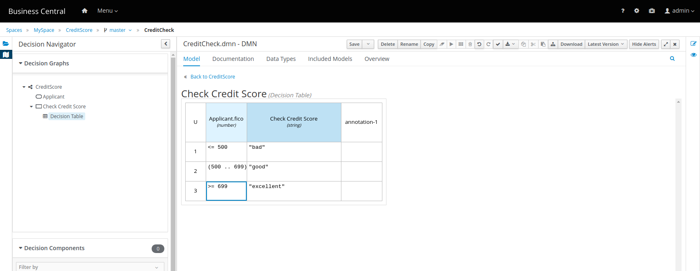

# JBoss Drools - DMN
  
## Create DMN model using [dmn.new](http://dmn.new/)

* Create the decision model  
    

* Define the data type 
   

* Define the decision table  
    

* Download the [DMN file](fico.dmn)  

## Use JBoss Drools locally

* Start the docker containers for business-central and kie-server
>docker run -p 8080:8080 -p 8001:8001 -d --name jbpm-workbench jboss/business-central-workbench-showcase:latest  
docker run -p 8180:8080 -d --name kie-server --link jbpm-workbench:kie-wb jboss/kie-server-showcase:latest  

* Login (admin/admin) to [business central](http://localhost:8080/business-central)  
     

* Create a new project and import the DMN file 
   

* Check the decision model
    

* Test the model  
    

* Deploy to KIE server  
    

* Check on the KIE server  
    

* Check the decision service schema  
    

## Execute the model
* Create the [input JSON](input.json) file  
* Invoke it from the command line!  
>curl -u kieserver:kieserver1! -H "accept: application/json" -H "content-type: application/json" -X POST "http://localhost:8180/kie-server/services/rest/server/containers/CreditScore/dmn" -d @input.json  
 
> {  
   "type" : "SUCCESS",  
   "msg" : "OK from container 'CreditScore'",  
   "result" : {  
     "dmn-evaluation-result" : {  
       "messages" : [ ],  
       "model-namespace" : "https://kiegroup.org/dmn/_4B1EDB3E-BB80-4CDD-8785-52AF13FFCD32",  
       "model-name" : "CreditScore",  
       "decision-name" : "Check Credit Score",  
       "dmn-context" : {  
         "Check Credit Score" : "excellent",  
         "Applicant" : {  
           "fico" : 700,  
           "name" : "John"  
         }  
      },  
      "decision-results" : {  
        "_5C29E6BC-E182-40B0-8FCD-D2F0312227B4" : {  
          "messages" : [ ],  
          "decision-id" : "_5C29E6BC-E182-40B0-8FCD-D2F0312227B4",  
          "decision-name" : "Check Credit Score",  
          "result" : "excellent",  
          "status" : "SUCCEEDED"  
        }  
      }  
    }  
  }  
}  

