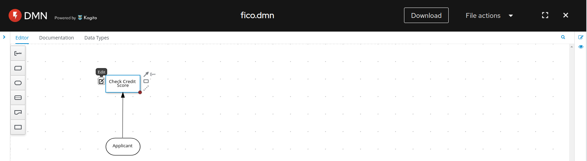
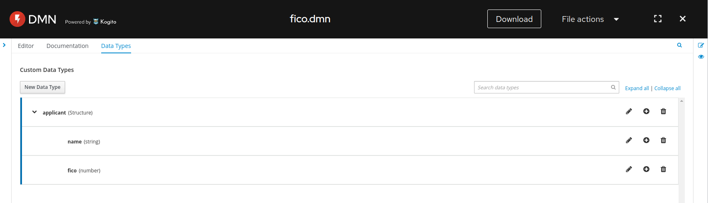
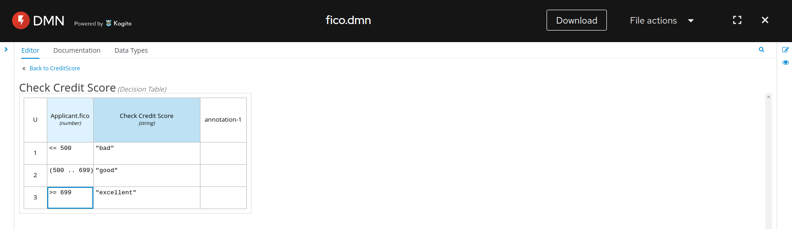
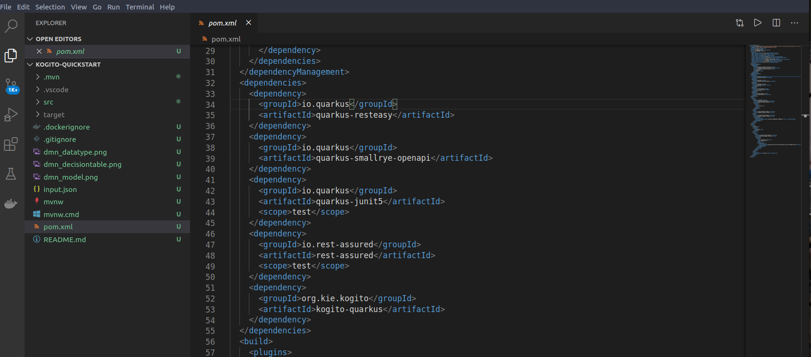
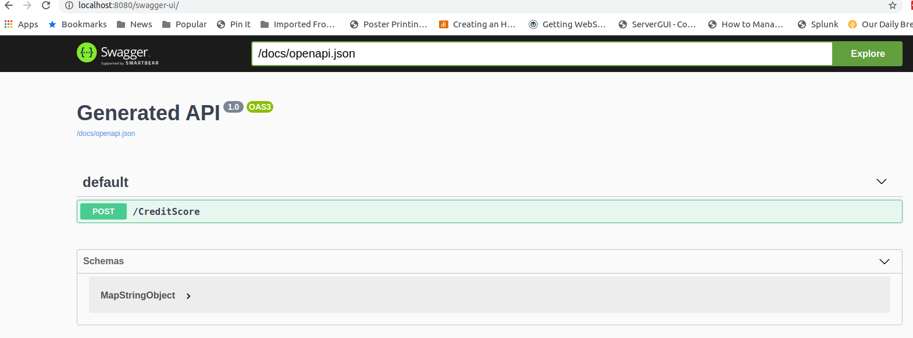
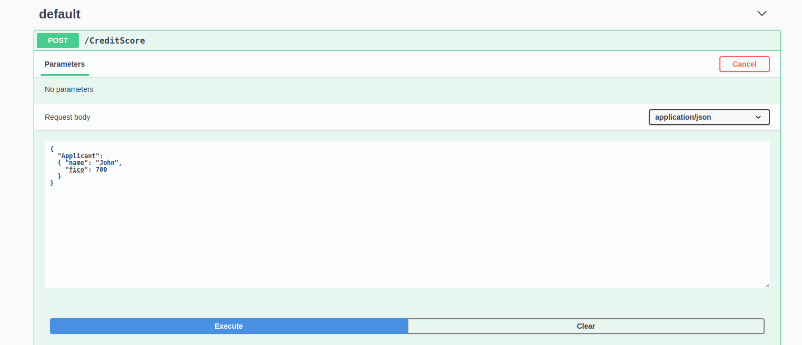
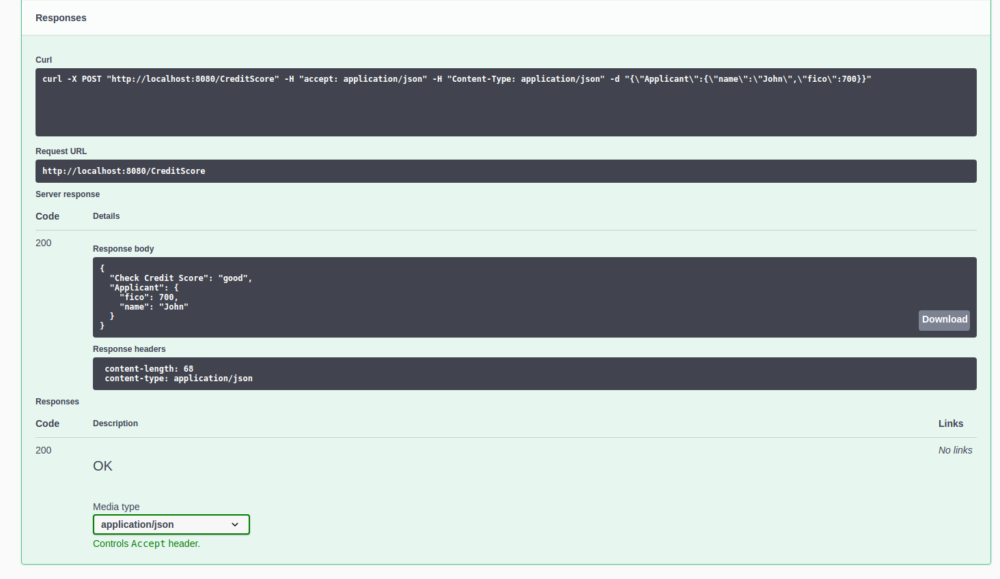

# Kogito - DMN

## Create DMN model using [dmn.new](http://dmn.new/)

* Create the decision model  
    

* Define the data type 
   

* Define the decision table  
    

* Download the [DMN file](src/main/resources/fico.dmn)  

## Set up a kogito maven project using VS Code

* Use the maven archetype  
<pre>
mvn io.quarkus:quarkus-maven-plugin:1.4.2.Final:create \
    -DprojectGroupId=org.acme \
    -DprojectArtifactId=kogito-quickstart \
    -Dextensions="kogito"
cd kogito-quickstart
</pre>

* Obtain & import the [vscode extension](https://github.com/kiegroup/kogito-tooling/releases) to edit / view DMN  

* Start vscode with extra argument to enable the proposed API  
```
code --enable-proposed-api kiegroup.vscode-extension-pack-kogito-kie-editors .
```  

* Add quarkus-smallrye-openapi as dependency in pom.xml then run in dev mode 
  

```
./mvnw quarkus:dev
```

## Execute the model!!

* Check the Swagger UI
  

* Try to execute the decision via the UI 
  
   


* On a different terminal, run a test  
```
curl -X POST "http://localhost:8080/CreditScore" -H "accept: application/json" -H "Content-Type: application/json" -d @input.json

{"Check Credit Score":"good","Applicant":{"fico":700,"name":"John"}}
```

* Packaging the app
>./mvnw package  
>java -jar target/kogito-quickstart-1.0-SNAPSHOT-runner.jar  

* Compile to native-image (requires GRAALVM)
>./mvnw package -Pnative  
>./target/kogito-quickstart-1.0-SNAPSHOT-runner  
