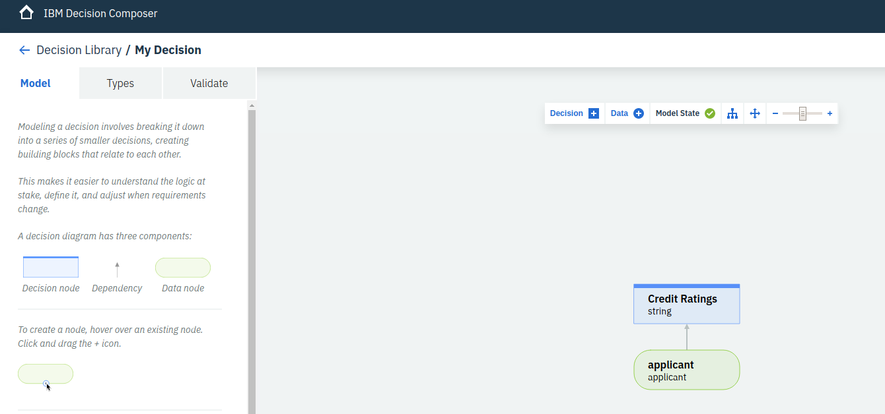

# Operational Decision Manager (ODM) 

## Use [Decision Composer](https://decision-composer.ibm.com) to generate and validate the decision model
* Generate the model
  
* Add the datatype
  
* Add the actual decision logic
  
* export the model as a zip file (e.g. My_Decision.zip)

## Use ODM locally
* Run ODM for developer locally using Docker: 
>docker run --name odm -i -t -d -e LICENSE=accept -p 9060:9060 -p 9443:9443 -m 4096M --memory-reservation 4096M -e SAMPLE=true ibmcom/odm
* login ( odmAdmin/odmAdmin ) to [Decision Center](http://localhost:9060/decisioncenter/login)
* import the ZIP file 
  
* deploy to RES
  
* check using the RES console
   
* get the HTDS OpenAPI - JSON descriptor  
    
  

## Execute the Decision Service!
* prepare a [JSON input file](input.json)
* hit the decision service endpoint
>curl -X POST http://localhost:9060/DecisionService/rest/My_Decision_RuleApp/1.0/My_Decision/1.0 -H 'content-type: application/json' -H 'accept: application/json' -d @input.json  
>{"__DecisionID__":"","Credit_Ratings":"Excellent"}
